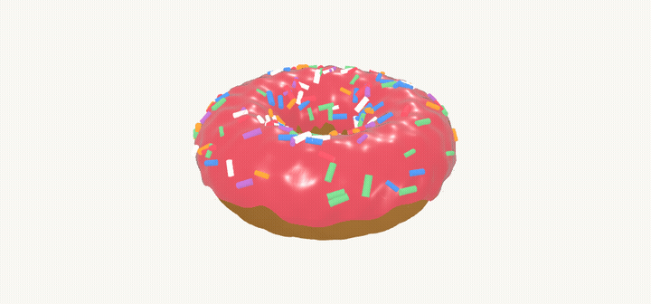
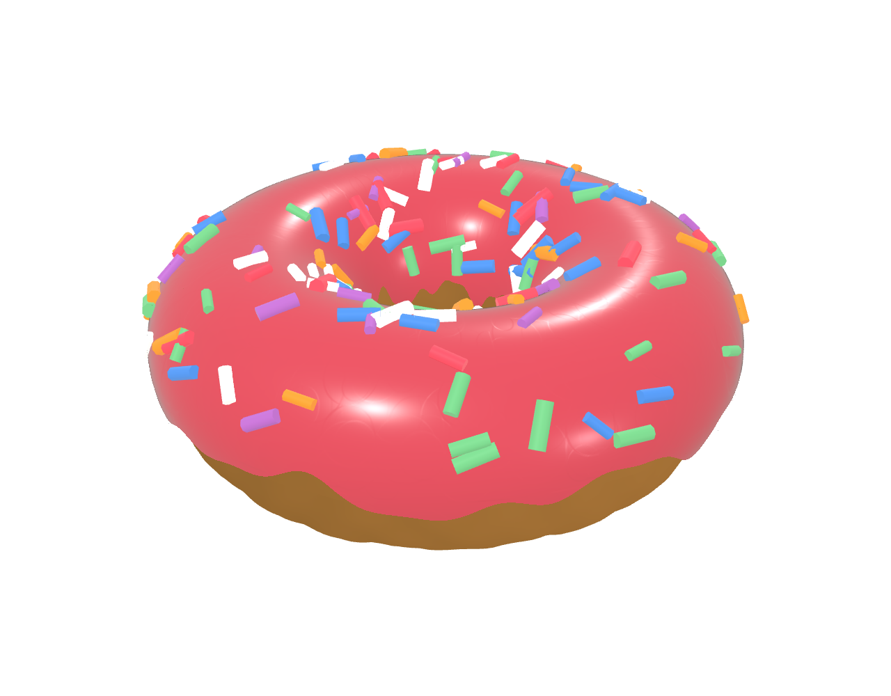
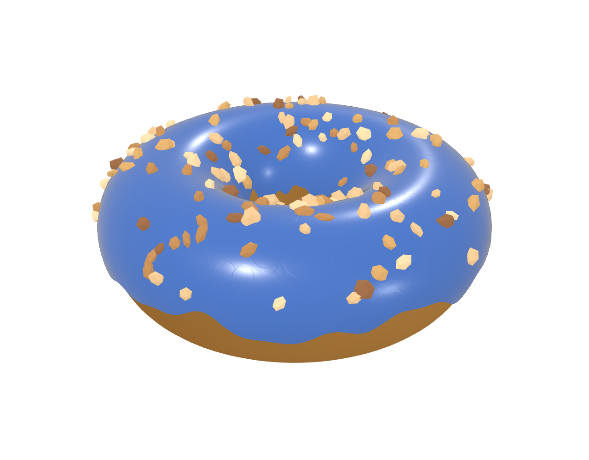
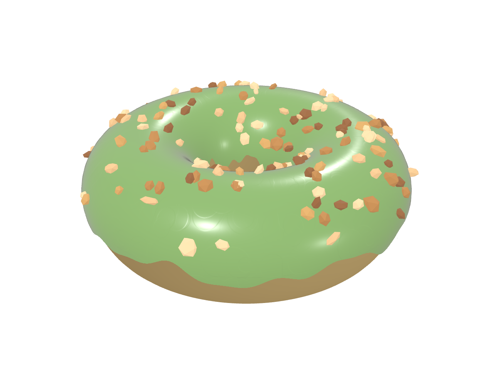
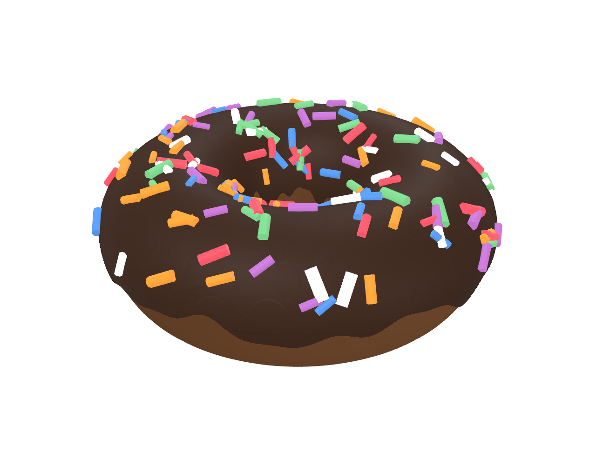
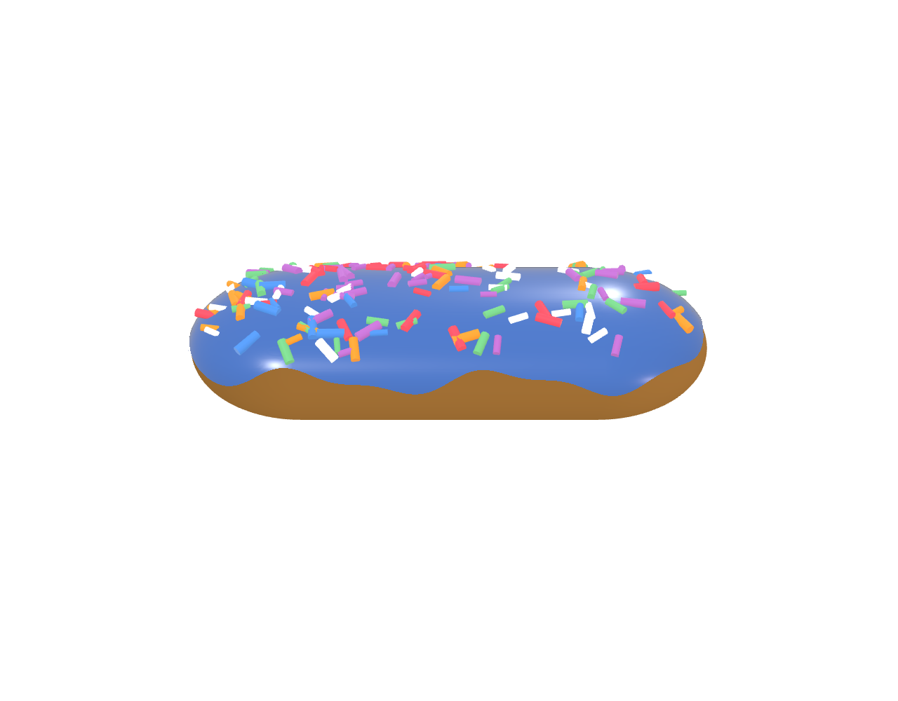
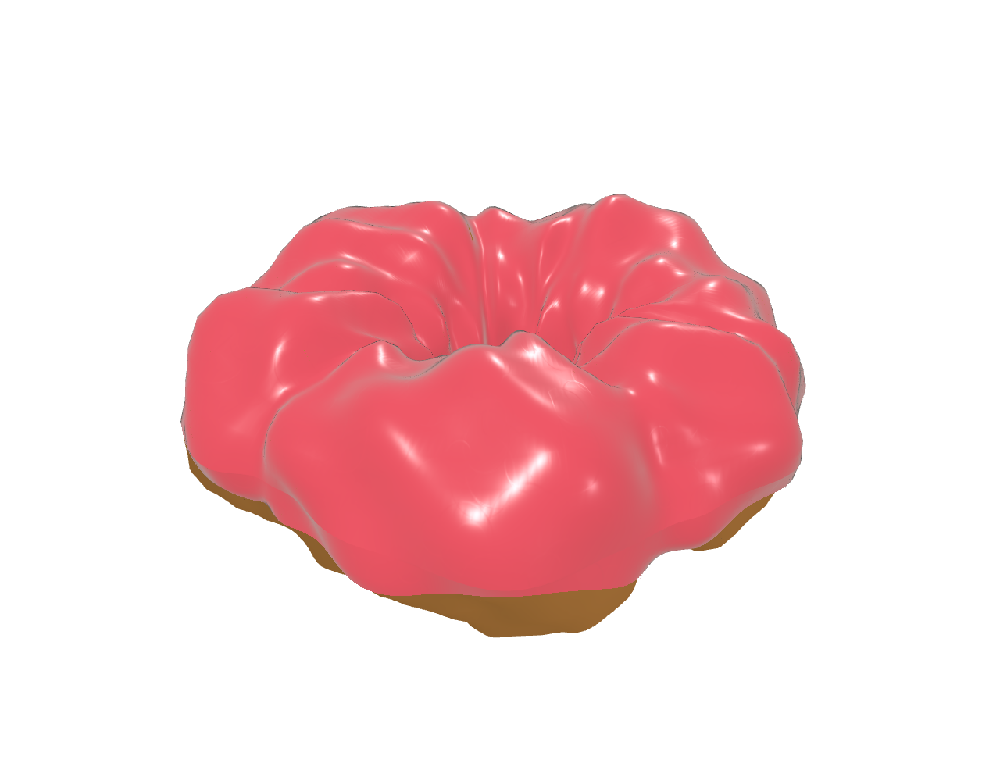

# glazy

Spinning 3D donuts in a `<canvas>`, rendered with [Three.js](https://threejs.org).


<!-- TODO: capture from examples/controls.html -->

Pick a preset, a shape, and a topping, or wire it up to live controls. Three.js is a peer dependency; glazy ships no other runtime dependencies and works from a plain `<script>` tag or as an ES module.

## Install

> The name `glazy` on npm is an unrelated package, so `npm i glazy` will not install this library. Distribution is via jsDelivr's GitHub passthrough against a tagged release. Pin a tag (not `@main`, which is mutable).

Script tag / CDN (UMD global). Load Three.js first, then the UMD bundle:

```html
<script src="https://cdn.jsdelivr.net/npm/three@0.160.0/build/three.min.js"></script>
<script src="https://cdn.jsdelivr.net/gh/ggoforth/glazy@v0.1.1/dist/glazy.umd.js"></script>
```

ES module (import map). See the next section for a full copy-pasteable snippet.

```js
import { DonutRenderer, autoInit } from 'https://cdn.jsdelivr.net/gh/ggoforth/glazy@v0.1.1/dist/glazy.esm.js';
```

If you build with a bundler, you can vendor the files or add a `package.json` git/file dependency pointing at this repo; the public package name on npm is not this library.

## No-build / static site (import map)

For a no-bundler static site (plain `.html` on S3 or any host), supply Three.js through an import map and load glazy from jsDelivr. glazy resolves `three` from the same import map, so you do not pass it or set a global. This snippet is copy-pasteable as-is:

```html
<script type="importmap">
{ "imports": { "three": "https://cdn.jsdelivr.net/npm/three@0.160.0/build/three.module.js" } }
</script>
<script type="module">
  import { autoInit } from 'https://cdn.jsdelivr.net/gh/ggoforth/glazy@v0.1.1/dist/glazy.esm.js';
  autoInit();
</script>

<div data-donut data-preset="strawberry"></div>
<div data-donut data-preset="blueberry" data-topping="nuts"></div>
<div data-donut data-preset="strawberry"></div>
```

`autoInit()` scans for `[data-donut]` elements and mounts one renderer per element, reading config from `data-*` attributes (see the table below). Multiple instances per page are supported. Each `[data-donut]` element should be positioned (give it a width and height); the canvas fills it. A runnable copy is in [`examples/cdn.html`](examples/cdn.html).

## Quick start (global / `<script>`)

The UMD bundle exposes a global `Glazy`. Three.js must be loaded first as the global `THREE`.

```html
<!doctype html><html><head><meta charset="utf-8"><title>glazy</title>
<style>body{margin:0;background:#faf7f2}.donut-stage{position:relative;width:100vw;height:100vh}</style></head>
<body>
  <div class="donut-stage" id="stage"></div>
  <script src="https://cdn.jsdelivr.net/npm/three@0.160.0/build/three.min.js"></script>
  <script src="https://cdn.jsdelivr.net/gh/ggoforth/glazy@v0.1.1/dist/glazy.umd.js"></script>
  <script>new Glazy.DonutRenderer(document.getElementById('stage'), { preset: 'strawberry' });</script>
</body></html>
```

See [`examples/global.html`](examples/global.html).

## Quick start (ESM)

`three` is a peer dependency. Import it yourself and pass it in, or rely on a global `THREE`. Below it is resolved through an import map.

```html
<!doctype html><html><head><meta charset="utf-8"><title>glazy</title>
<style>body{margin:0;background:#faf7f2}#stage{position:relative;width:100vw;height:100vh}</style>
<script type="importmap">{ "imports": { "three": "https://cdn.jsdelivr.net/npm/three@0.160.0/build/three.module.js" } }</script>
</head><body>
  <div id="stage"></div>
  <script type="module">
    import * as THREE from 'three';
    import { DonutRenderer } from 'https://cdn.jsdelivr.net/gh/ggoforth/glazy@v0.1.1/dist/glazy.esm.js';
    new DonutRenderer(document.getElementById('stage'), { three: THREE, shape: 'old-fashioned', frost: 0x8fbf6f });
  </script>
</body></html>
```

In a bundler-based project:

```js
import * as THREE from 'three';
import { DonutRenderer } from 'glazy';

const donut = new DonutRenderer('#stage', { three: THREE, preset: 'blueberry' });
```

See [`examples/esm.html`](examples/esm.html).

## Data attributes (auto-init)

Mark any element with `data-donut` and call `autoInit()`. The UMD build does this automatically on `DOMContentLoaded`. The parsed `data-*` attributes are the explicit options for that instance, and multiple instances per page are supported.

| Attribute | Maps to option | Example |
|---|---|---|
| `data-donut` | marker (required) | `<div data-donut></div>` |
| `data-shape` | `shape` | `data-shape="bar"` |
| `data-preset` | `preset` | `data-preset="strawberry"` |
| `data-frost` | `frost` | `data-frost="#3a73cf"` |
| `data-dough` | `dough` | `data-dough="#df9f48"` |
| `data-frost-finish` | `frostFinish` | `data-frost-finish="frosting"` |
| `data-topping` | `topping` | `data-topping="nuts"` |
| `data-count` | `toppingCount` | `data-count="80"` |
| `data-fill` | `fillLight` | `data-fill="#e6f0ff"` |
| `data-seed` | `seed` | `data-seed="42"` |
| `data-spin-speed` | `motion.spin.speed` | `data-spin-speed="0.01"` |
| `data-spin-direction` | `motion.spin.direction` | `data-spin-direction="-1"` |
| `data-wobble` | `motion.wobble.enabled` | `data-wobble="false"` |
| `data-bob` | `motion.bob.enabled` | `data-bob="false"` |
| `data-mouse-lean` | `motion.lean.enabled` | `data-mouse-lean="false"` |
| `data-lean-strength` | `motion.lean.strength` | `data-lean-strength="0.4"` |
| `data-lean-source` | `motion.lean.source` | `data-lean-source="element"` |

Booleans: `"true"`, `""` (bare attribute), or a present attribute mean `true`; `"false"` and `"0"` mean `false`.

```html
<div data-donut data-preset="strawberry"></div>
<div data-donut data-preset="chocolate" data-shape="bar"></div>
<script src="https://cdn.jsdelivr.net/npm/three@0.160.0/build/three.min.js"></script>
<script src="https://cdn.jsdelivr.net/gh/ggoforth/glazy@v0.1.1/dist/glazy.umd.js"></script>
```

See [`examples/autoinit.html`](examples/autoinit.html).

## Options

Resolution order is `defaults`, then `preset`, then explicit options. When a flat alias and the structured `motion` object set the same value, `motion` wins. Colors accept `0xRRGGBB` numbers, `'#rrggbb'`, `'rrggbb'`, or `'0xRRGGBB'` strings; an invalid value falls back to the default and logs one `console.warn`.

| Option | Type | Default | Notes |
|---|---|---|---|
| `three` | THREE \| null | `null` | injected; falls back to global `THREE`, then to a bundled bare `three` import (resolved by an import map) |
| `shape` | string | `'ring'` | `'ring'`, `'bar'`, `'old-fashioned'` |
| `preset` | string \| null | `null` | merged under explicit options |
| `dough` | color | `0xdf9f48` | accepts `0xRRGGBB`, `'#rrggbb'`, `'rrggbb'`, number |
| `frost` | color | `0xed4359` | glaze/frosting color |
| `frostFinish` | string | `'glaze'` | `'glaze'` or `'frosting'` |
| `frostRoughness` | number | finish-dependent | clamped `[0,1]` |
| `frostClearcoat` | number | finish-dependent | clamped `[0,1]` |
| `glazeTextureScale` | number | `1` | surface-relief strength |
| `doughRoughness` | number | `0.82` | clamped `[0,1]` |
| `doughGrain` | number | `1` | grain bump intensity |
| `crust` | bool \| number | `true` | crust-tone strength (`true` is the default amount) |
| `fillLight` | color | `0xffe6ef` | fill-light tint |
| `topping` | string | `'sprinkles'` | `'sprinkles'`, `'nuts'`, `'none'` |
| `sprinkleColors` | color[] | brand palette | |
| `nutColors` | color[] | tan to walnut | |
| `toppingCount` | int | `150` | clamped `[0, 2000]` |
| `motion` | object | see below | per-behavior motion and interaction config |
| `spinSpeed` | number | `0.004` | alias for `motion.spin.speed` |
| `wobble` | bool | `true` | alias for `motion.wobble.enabled` |
| `mouseLean` | bool | `true` | alias for `motion.lean.enabled` |
| `reducedMotion` | `'auto'` \| bool | `'auto'` | responds live via `matchMedia` |
| `pixelRatioCap` | number | `2` | |
| `seed` | int \| null | `null` | makes placement and colors reproducible |
| `materials` | object | `{}` | deep override: `{ dough: {...}, frost: {...} }` |

### `motion`

Each behavior is independently toggleable and tunable. Every sub-object also accepts a boolean shorthand (`spin: false` is off, `spin: true` is defaults).

```js
motion: {
  spin:   { enabled: true, speed: 0.004, direction: 1 },
  wobble: { enabled: true, amplitude: 0.05, speed: 0.9 },
  bob:    { enabled: true, amplitude: 0.045, speed: 1.1 },
  lean:   { enabled: true, strength: 0.16, ease: 0.045, source: 'window' },
}
```

| Behavior | Knobs | Effect |
|---|---|---|
| `spin` | `enabled`, `speed`, `direction` | turntable yaw about the hole axis (`direction` is `1` or `-1`) |
| `wobble` | `enabled`, `amplitude`, `speed` | oscillating pitch and roll sway |
| `bob` | `enabled`, `amplitude`, `speed` | vertical float |
| `lean` | `enabled`, `strength`, `ease`, `source` | eased tilt toward the pointer |

`lean.source` is `'window'` (default; tilts toward the pointer anywhere on the page) or `'element'` (only while the pointer is over the donut's own element, which is better when several donuts share a page). `lean.ease` is the smoothing factor (default `0.045`); lower follows more lazily, higher more sharply.

Reduced motion suppresses all four behaviors, lean included, and renders a single static frame.

## Presets

Named option sets, merged under any explicit fields, so individual options always override the preset.

| Preset | Finish | Frost | Dough | Topping | Fill | Thumbnail |
|---|---|---|---|---|---|---|
| `strawberry` | glaze | pink `0xed4359` | golden `0xdf9f48` | sprinkles | warm `0xffe6ef` |  |
| `blueberry` | glaze | blue `0x3a73cf` | golden `0xdf9f48` | nuts | cool `0xe6f0ff` |  |
| `matcha` | glaze | green `0x8fbf6f` | golden `0xe7c98a` | nuts | cool `0xeef6e6` |  |
| `chocolate` | frosting | brown `0x4a2c1a` | dark `0x8a5a32` + crust | sprinkles | neutral `0xfff0e6` |  |

<!-- TODO: capture preset thumbnails from examples/autoinit.html -->

```js
new DonutRenderer('#stage', { three: THREE, preset: 'matcha' });
```

## Shapes

| Shape | `shape` value | Thumbnail |
|---|---|---|
| Ring | `'ring'` |  |
| Bar | `'bar'` |  |
| Old-fashioned | `'old-fashioned'` |  |

<!-- TODO: capture shape thumbnails from examples/controls.html -->

## Three.js compatibility

glazy requires `three >= r160` and is tested against `three` r160.0. Known-good CDN builds: `https://cdn.jsdelivr.net/npm/three@0.160.0/build/three.module.js` for the ESM/import-map path and `https://cdn.jsdelivr.net/npm/three@0.160.0/build/three.min.js` for the UMD/global path.

It uses the modern Three.js color-space API (`renderer.outputColorSpace = THREE.SRGBColorSpace` and per-texture `colorSpace`), which replaced the `outputEncoding` / `sRGBEncoding` API removed before r160. Version-sensitive color handling is isolated in `src/three-compat.js` and `src/materials/textures.js` (color maps tagged sRGB, normal maps left linear).

Three is a peer dependency and is never bundled. glazy finds it in this order: an injected `three` option, a global `THREE`, then a bundled bare `import ... from 'three'` that an import map resolves. If none resolve, glazy logs one warning and returns an inert instance whose methods are safe no-ops. It never throws.

## Lifecycle and SPA use

```js
const donut = new DonutRenderer('#stage', { three: THREE, preset: 'strawberry' });

donut.setOptions({ frost: 0x3a73cf, topping: 'nuts', shape: 'bar' }); // live update
donut.screenshot();   // returns a PNG data URL (preserveDrawingBuffer is on)
donut.destroy();      // releases GPU resources and listeners
```

Call `destroy()` on unmount. It cancels the animation loop, disconnects the `ResizeObserver` and `IntersectionObserver`, removes the pointer and `matchMedia` listeners, disposes every geometry, material, texture, and render target, disposes the renderer, removes the canvas, and nulls references. In React, call it from the effect cleanup; in Vue, from `onUnmounted`.

`setOptions` rebuilds only what changed. Cheap changes such as `spinSpeed` touch only the animation, recoloring touches the material, and changing `shape` rebuilds the body.

The canvas is given `aria-hidden="true"`. Treat the donut as decorative and provide text alternatives elsewhere if it conveys meaning.

`prefers-reduced-motion: reduce` renders a single static frame and suppresses all motion; a `matchMedia` listener responds live. The `reducedMotion` option (`true` or `false`) overrides auto-detection.

## Performance

`pixelRatioCap` (default `2`) bounds the device pixel ratio so high-DPI displays do not render at excessive resolution. An `IntersectionObserver` pauses the loop when the canvas scrolls off-screen and resumes on re-entry. A `ResizeObserver` on the target element keeps the canvas sized without a global `window.resize` listener. Set `seed` to make topping placement and color selection reproducible (a mulberry32 PRNG threaded through the shape and topping factories), which is useful for visual regression and stable thumbnails.

## License

MIT, 2026 Greg Goforth. See [LICENSE](LICENSE).
